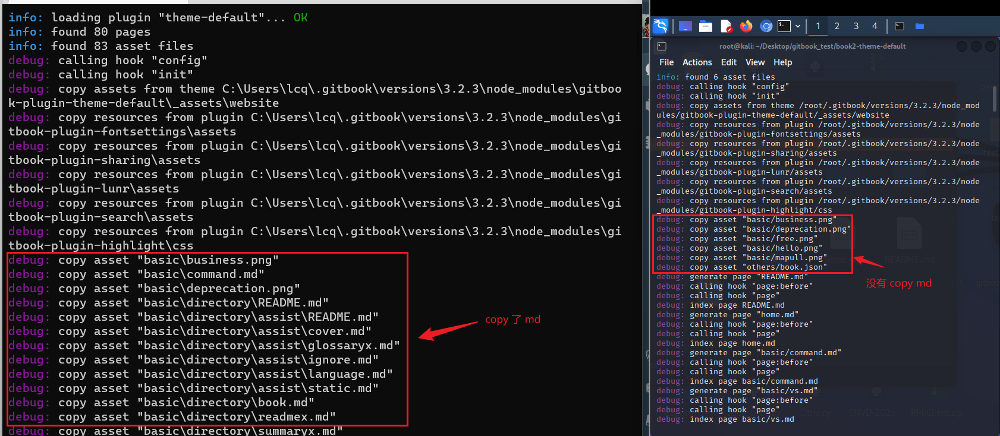
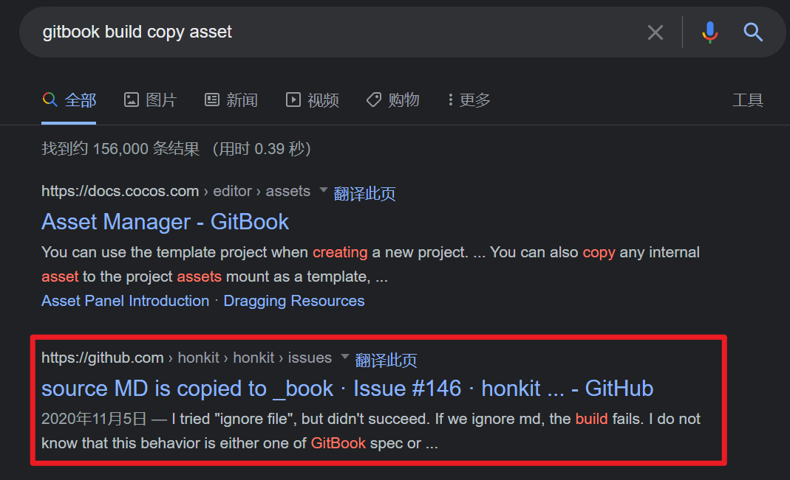

>  记录安装和使用 gitbook 可能会遇到的一些错误。

## NPM 运行错误 1

**错误描述**

npm : 无法加载文件 D:\...\nodejs\npm.ps1，因为在此系统上禁止运行脚本。

**解决办法**

1. 在终端输入 `get-ExecutionPolicy` 查看执行策略/权限；  
    输出 Restricted (受限制的)；
2. 终端输入 `Set-ExecutionPolicy -Scope CurrentUser` 命令给用户赋予权限；  
    输入 RemoteSigned；
3. 终端输入 `get-ExecutionPolicy` 查看一下权限，显示 RemoteSigned 就可以了。<br />

## NPM 运行错误 2

**错误描述**

[javascript - 如何使用 loadVirtual 和 ENOLOCK 修复 npm 审计错误？](https://www.coder.work/article/7544033)

```bash
➜   npm audit
npm ERR! code ENOLOCK
npm ERR! audit This command requires an existing lockfile.
npm ERR! audit Try creating one first with: npm i --package-lock-only
npm ERR! audit Original error: loadVirtual requires existing shrinkwrap file
```

我运行 npm audit 并收到此错误。  
当我在下面运行时:  
➜ npm config get package-lock  
true

➜ npm config get shrinkwrap  
true  
有人可以帮忙吗？至于如何解决？并且 `npm audit fix --force` 也无法正常工作...

**解决办法**

`npm i --package-lock-only`

## NPM 提示信息

**错误描述**

1 package is looking for funding run `npm fund` for details.

1 package is looking for funding  
  run `npm fund` for details

**解决办法**

一般不是报错，运行一下 `npm fund` 就会发现有可能是开源项目寻求 donate。

​

## gitbook init 错误

**错误描述**

运行 `gitbook init` 命令报错：TypeError [ERR_INVALID_ARG_TYPE]: The “data” argument must be of type string or an instance of Buffer,TypedArray, or DataView. Received an instance of Promise.<br />

**解决办法**

nodejs 版本过高导致的。

1. 卸载高版本 node.js，重新安装稍低版本的 node.js（Win 推荐 nvm 进行版本管理）
2. 我之前装的是16版本，降到12版本 就可以了  
    C:\book>node -v  
    v12.16.2

```bash
C:\book>gitbook init
warn: no summary file in this book
info: create README.md
info: create SUMMARY.md
info: initialization is finished....
```

## gitbook 新版本 "gitbook build" 命令导出的 html 不能跳转的解决办法

**错误描述**

html 无法跳转。由于点击事件被 js 代码禁用，所以点击没有反应，但是如果右键，在新窗口/新标签页打开的话是可以跳转的。

**解决办法**

1. 找到 js 代码，并修改
   
   1. 找到项目目录 gitbook
   2. 找到目录下的 theme.js 文件
   3. 找到下面的代码
   4. 将 `if(m)` 改成 `if(false)`

2. 由于代码是压缩后的，会没有空格，搜索的时候可以直接搜索： `if(m)for(n.handler&&` 修改保存即可。

## node.js - Gitbook-cli 安装错误 TypeError： cb.apply 不是 graceful-fs 中的函数 - 堆栈溢出

**错误描述**

```bash
PS D:\xxx\zha0cai> npm install gitbook-cli -g
D:\Java\nodejs\gitbook -> D:\Java\nodejs\node_modules\gitbook-cli\bin\gitbook.js
+ gitbook-cli@2.3.2
added 578 packages from 672 contributors in 99.895s
PS D:\xxx\zha0cai> gitbook --version
CLI version: 2.3.2
Installing GitBook 3.2.3
D:\Java\nvm\v12.22.12\node_modules\gitbook-cli\node_modules\npm\node_modules\graceful-fs\polyfills.js:287
      if (cb) cb.apply(this, arguments)
                 ^

TypeError: cb.apply is not a function
    at D:\Java\nvm\v12.22.12\node_modules\gitbook-cli\node_modules\npm\node_modules\graceful-fs\polyfills.js:287:18
    at FSReqCallback.oncomplete (fs.js:169:5)
```

**解决办法**

* 方法一：[gitbook 安装问题 - polyfills.js:287 - 简书 (jianshu.com)](https://www.jianshu.com/p/ecc6ef859ccd)
  
  打开 D:\Java\nvm\v12.22.12\node_modules\gitbook-cli\node_modules\npm\node_modules\graceful-fs\polyfills.js
  
  搜索 `fs.stat` 将下面三行代码注释掉 62 - 64 行
  
  ```js
    //fs.stat = statFix(fs.stat)
    //fs.fstat = statFix(fs.fstat)
    //fs.lstat = statFix(fs.lstat)
  ```
  
  代替软件：[honkit/honkit：HonKit正在使用Markdown构建漂亮的书籍 - GitBook的分叉](https://github.com/honkit/honkit)

* 方法二：[node.js - Gitbook-cli 安装错误 TypeError： cb.apply 不是 graceful-fs 中的函数 - 堆栈溢出 (stackoverflow.com)](https://stackoverflow.com/questions/64211386/gitbook-cli-install-error-typeerror-cb-apply-is-not-a-function-inside-graceful)
  
  C:\Users\xxx\AppData\Local\Temp\npm-13732-f16d4b38\registry.npmjs.org\gitbook-cli
  
  ```shell
  for those who are very busy and have no time to debug:
  
  install an older version of gitbook:
   npm install gitbook-cli@2.1.2 --global
  modify this file: vim ~/.gitbook/versions/3.2.3/lib/output/website/copyPluginAssets.js, Replace all confirm: true to
  confirm: false
  gitbook serve
  ```

* 方法三：
  
  * cd D:\Java\nodejs\node_modules\gitbook-cli\node_modules\npm\node_modules
  
  * `npm install graceful-fs@latest --save`
    
    ```js
    npm notice created a lockfile as package-lock.json. You should commit this file.
    + graceful-fs@4.2.10
    added 662 packages from 108 contributors, updated 1 package and audited 1018 packages in 202.544s
    
    6 packages are looking for funding
      run `npm fund` for details
    
    found 56 vulnerabilities (4 low, 21 moderate, 23 high, 8 critical)
      run `npm audit fix` to fix them, or `npm audit` for details
    ```
  
  * 重新执行
    
    ```shell
    PS D:\xxx\zha0cai> gitbook --version
    CLI version: 2.3.2
    PS D:\Mob\zha0cai> npm install -g gitbook-cli
    D:\Java\nodejs\gitbook -> D:\Java\nodejs\node_modules\gitbook-cli\bin\gitbook.js
    + gitbook-cli@2.3.2
    removed 662 packages and updated 4 packages in 50.191s
    PS D:\xxx\zha0cai> gitbook --version
    CLI version: 2.3.2
    Installing GitBook 3.2.3
    ```

## Windows 下 gitbook build 出来的 _book 章节里面会包含 md 文件

**错误描述**

一个巨坑：==子目录（章节）==Linux build 出来的 _book 只会有 html 静态文件，但是 Windows 编译出来的会 md 和 html 共存。

**解决办法**

整了我一天茶饭不思后，第二天突然给小麦说了下，他在 Linux 下完美 build ，完全不会出现我这样的问题。那么问题来了，肯定就是 OS 的差异导致的，gitbook build --log debug 查看一下构建的日志。

​

可以看到 win 下 copy asset 会把子目录的 md 也一并复制，最终 google 搜索了一波关键字 `gitbook build copy asset` 关键字。全网独一条，老古董可太难了。。。最终还是 [honkit](https://github.com/honkit/honkit) 的一个 issue 解决了困扰我两天的问题。当然，你直接使用 Honkit 就不会有这个问题了。

​

**我爱他**

[https://github.com/honkit/honkit/issues/146](https://github.com/honkit/honkit/issues/146)

[https://github.com/honkit/honkit/pull/147/commits/c8cd086cfc24cb16bf425b11311f2520bb70b1a0](https://github.com/honkit/honkit/pull/147/commits/c8cd086cfc24cb16bf425b11311f2520bb70b1a0)

修改的文件路径 `C:\Users\xxx\.gitbook\versions\3.2.3\lib\parse\listAssets.js`

​

> 罪魁祸首：目录符号的差异
> 
> ```bash
> fs.listallFiles returns paths that use '\\' as a path separator
> on Windows.
> `pages` object includes paths that uses '/' as a path separator.
> So replace all '\\' of path in function filterFile()
> ```

## Highlight 导致的错误

**错误描述**

```bash
warn: "this.generator" property is deprecated, use "this.output.name" instead
warn: "navigation" property is deprecated
warn: "book" property is deprecated, use "this" directly instead
warn: "options" property is deprecated, use config.get(key) instead

Could not find the language 'json:book.json', did you forget to load/include a language module?
Error: Unknown language: "json:book.json"
    at _highlight (D:\Java\nvm\v16.17.0\node_modules\honkit\node_modules\highlight.js\lib\core.js:1972:13)
    at Object.highlight (D:\Java\nvm\v16.17.0\node_modules\honkit\node_modules\highlight.js\lib\core.js:1626:9)
    at highlight (D:\Java\nvm\v16.17.0\node_modules\honkit\node_modules\@honkit\honkit-plugin-highlight\index.js:36:21)
    at Object.code (D:\Java\nvm\v16.17.0\node_modules\honkit\node_modules\@honkit\honkit-plugin-highlight\index.js:60:20)
```

**解决办法**

观察 `build` 输出，将 highlight 插件注释掉。(该报错不影响使用~)

```bash
PS D:\xxx\zha0cai\gitbook-guide-book> honkit build
(node:16660) [DEP0147] DeprecationWarning: In future versions of Node.js, fs.rmdir(path, { recursive: true }) will be removed. Use fs.rm(path, { recursive: true }) instead
(Use `node --trace-deprecation ...` to show where the warning was created)
info: 13 plugins are installed
info: 13 explicitly listed
info: plugin "search-pro" is loaded
info: plugin "code" is loaded
info: plugin "splitter" is loaded
info: plugin "anchor-navigation-ex" is loaded
info: plugin "expandable-chapters" is loaded
info: plugin "versions-select" is loaded
info: plugin "ace" is loaded
info: plugin "chart" is loaded
info: plugin "graph" is loaded
info: plugin "katex" is loaded
info: plugin "highlight" is loaded
info: plugin "fontsettings" is loaded
info: plugin "theme-comscore" is loaded
info: plugin "theme-default" is loaded
info: found 85 pages
info: found 32 asset files
init!
```
