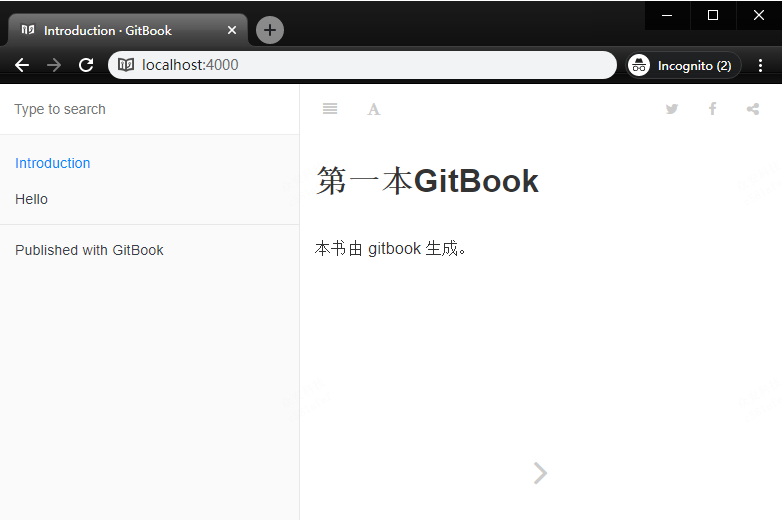

# 第一本电子书

基于上面的认识，可以用 gitbook 来制作第一本电子书。

## 初始化环境

现在，需要在一个空文件夹中创建自己的一本书。

首先，在该文件(`D:\temp`)下执行命令：

`gitbook init`

```x86asm
D:\temp>gitbook init
warn: no summary file in this book
info: create README.md
info: create SUMMARY.md
info: initialization is finished
```

自动创建了两个文件：

`README.md` 和 `SUMMARY.md`

## 添加说明到 README.md

```
# 第一本GitBook

本书由 gitbook 生成。
```

## 添加一个 markdown 文件

我新建了一个 `hello.md` 的文件，并写入如下内容。

```
# Hello World

### 欢迎语

欢迎你来到 GitBook 的世界，希望这里有你想要的东西。
```

## 添加菜单到 SUMMARY.md

```powershell

# Summary

* [Introduction](README.md)

* [Hello](hello.md)
```

## 启动服务

在控制台输入命令：`gitbook serve`

```x86asm
D:\temp>gitbook serve
Live reload server started on port: 35729
Press CTRL+C to quit ...
info: 7 plugins are installed
info: loading plugin "livereload"... OK
info: loading plugin "highlight"... OK
info: loading plugin "search"... OK
info: loading plugin "lunr"... OK
info: loading plugin "sharing"... OK
info: loading plugin "fontsettings"... OK
info: loading plugin "theme-default"... OK
info: found 2 pages
info: found 4 asset files
info: >> generation finished with success in 0.6s !

Starting server ...
Serving book on http://localhost:4000
```

看到这样的输出，直接在浏览器访问 [http://localhost:4000/](http://localhost:4000/)



## 文件目录分析

现在去主文件夹(`D:\temp`)看可以看到新生成了一个文件夹 `_book`

```:总体文件结构
.
├── _book
├── hello.md
├── README.md
└── SUMMARY.md
```

打开 文件夹 `_book`

```:内部文件结构
.
├── gitbook
|    ├── fonts
|    ├── gitbook-plugin-fontsettings
|    ├── gitbook-plugin-highlight
|    ├── gitbook-plugin-livereload
|    ├── gitbook-plugin-lunr
|    ├── gitbook-plugin-search
|    ├── gitbook-plugin-sharing
|    ├── images
|       ├── apple-touch-icon-precomposed-152.png
|       └── favicon.ico
|    ├── gitbook.js
|    ├── style.css
|    └── theme.js
├── hello.html
├── index.html
└── search_index.json
```

这个 文件夹 `_book` 中包含了点子书中的所有内容，将整个文件夹打包放在任何一个 web 服务器中，都能正常显示。

这是个非常简单的例子，之后通过 `book.json`的配置和插件的扩展，能实现更多个性化的功能。