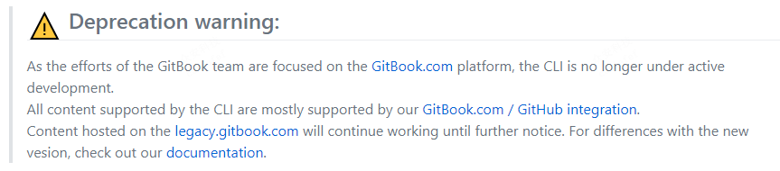

# GitBook 对比

## GitBook vs gitbook.com

GitBook 是一个命令行工具，是一个基于 Node.js 的开源平台。你可以使用 Markdown 或者 AsciiDoc 语法，加上几个命令就能创建一本漂亮的图书。

GitBook地址：`https://github.com/GitbookIO/gitbook`

gitbook.com 是 GitBook 的商业化运营网站，是由 GitBook 的原班人马打造的基于 GitBook 的现代化的文档平台， 团队可以在其中记录从产品到内部知识库和API的所有内容。
gitBook.com 提供了一个简单高效的图书在线撰写、发布和托管方案， 你可以通过 gitBook.com 进行在线编辑，发布，分享。
gitBook.com 提供的服务对个人用户免费，但是商业版权比较贵。

 PK 

gitbook.com 地址：`https://www.gitbook.com/`

**GitBook 是一个技术工具**，gitbook.com 是一个网站。
技术人员更倾向于使用 GitBook 来打造自己个性的电子书，非技术人员可以使用 gitbook.com 提供的功能来满足的自己的需要。

gitbook.com 目前没有在国内建造数据中心，因此，访问受限，很多服务在国内无法使用，能访问的网页速度也相对较慢。

GitBook 目前已经停止维护了，主要精力都在维护gitbook.com。

使用 GitBook，不需要联网就可以在您的计算机上创建本地书籍。
通过 GitBook.com 网站在线编辑你的书，不用担心电脑故障导致文章丢失，因为它就在云端。

## GitBook vs git vs github

git同 GitBook 一样，是一个工具。技术人员可能很早就知道 git ,却不一定知道 GitBook，就目前而言，git  是目前世界上最先进的分布式版本控制系统。
同样地，GitBook 和 git 都是开源的，你可以使用 git 提供的版本控制功能，来处理 GitBook 生成的电子书的不同版本。

因此，git 和 GitBook 都是工具， 可以说没有啥关系，要说关联，仅仅是可以搭配使用而已。

github 是 git 这项技术的商业化运营网站，全球最大的一个面向开源及私有软件项目的托管平台。github 提供的服务对个人用户免费，是最大的‘同性交友平台’，目前被微软收购。

GitBook 的源代码托管在 github 平台：`https://github.com/GitbookIO/gitbook`

gitbook.com 提供了与 github 对接的功能，可以方便地将托管在 github 上的 md 文件生成电子书。

_如果你没有用过命令行工具，不知道什么是 git, 从来没听说过 github，都不妨碍你使用 gitbook。_