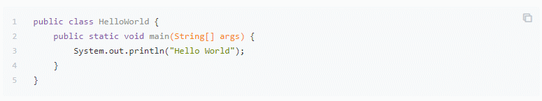
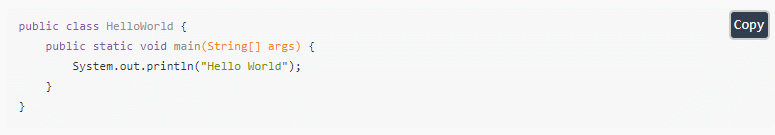

# code

GitBook插件：为代码块添加复制的图标。

> [!TIP|style:flat|iconVisibility:hidden|labelVisibility:hidden]
> npm install gitbook-plugin-code

```json
{
    "plugins": [
        "code"
    ],
    "pluginsConfig": {
        "code": {
            "copyButtons": true
        }
    }
}
```

添加了代码的 **行号**，右上角还多了一个复制的**图标**，点击复制后图标变成 **对号**。

当前版本启用了该插件。



## Copy-code-button

为代码块添加复制的按钮。

> [!TIP|style:flat|iconVisibility:hidden|labelVisibility:hidden]
> npm install gitbook-plugin-copy-code-button

[https://github.com/WebEngage/gitbook-plugin-copy-code-button](https://github.com/WebEngage/gitbook-plugin-copy-code-button)

```json
{
    "plugins": ["copy-code-button"]
}
```

效果如下图所示：



使用这个插件不好的地方是，图标显得有点突兀，可能和当前主题不搭。

还有就是点击 `Copy` 以后，会全选当前的代码，有点奇怪。
