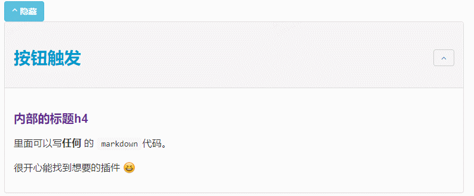

# 页面分块

Gitbook 插件：将页面分块显示

## Sectionx

> [!TIP|style:flat|iconVisibility:hidden|labelVisibility:hidden]
> npm install gitbook-plugin-sectionx

[https://github.com/ymcatar/gitbook-plugin-sectionx](https://github.com/ymcatar/gitbook-plugin-sectionx)

标签的 tag 最好是使用 `b` 标签，如果使用 `h1-h6` 可能会和其他插件冲突。

```json
{
    "plugins": [
       "sectionx"
   ],
    "pluginsConfig": {
        "sectionx": {
          "tag": "b"
        }
      }
}
```
上面 tag 标签，可选值：`h1, h2, h3, h4, h5, h6, b`

### 使用方法

在 md 文档中，使用语法：

```markdown
<!--sec data-title="这里写标题" data-id="section0" data-show=true ces-->
这里是markdown内容1
这里是markdown内容2
这里是内容3
<!--endsec-->
```

#### 参数的作用

- data-title：收缩模块的标题，大小在插件参数配置里面配置，注意：HTML中实体字符要转义
- data-id：收缩模块的id，用于插件的控制按钮，下面讲解
- data-show：模式默认是收缩还是展开的，true：展开，false：隐藏
- data-nopdf：在pdf中显示的情况，设为true不显示
- data-collapse：其中的数据是否默认显示


##### 使用示例

```markdown
<!--sec data-title="标题" data-id="section0" data-show=true ces-->
### 内部的标题最大从 h3开始

里面可以写**任何** 的 `markdown`代码。

很开心能找到想要的插件 :smile:
<!--endsec-->
```


也可以通过一个 button 来触发折叠：

`<button class="section" target="section1" show="Show next section" hide="Hide next section"></button>`

```markdown
<!--sec data-title="按钮触发" data-id="section1" data-show=true ces-->
#### 内部的标题h4

里面可以写**任何** 的 `markdown`代码。

很开心能找到想要的插件 :laughing:
<!--endsec-->
```




