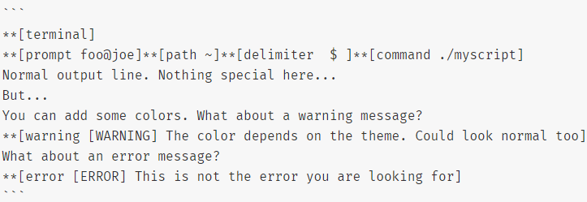
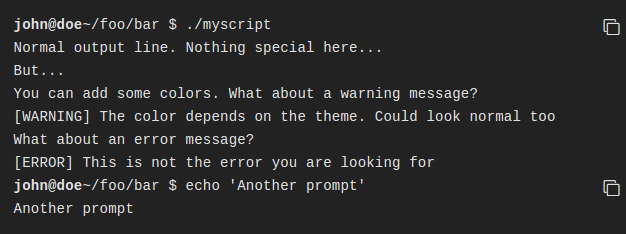

# Terminal

Gitbook 插件：模拟终端显示，主要用于显示命令以及多行输出，不过写起来有些麻烦。


> [!TIP|style:flat|iconVisibility:hidden|labelVisibility:hidden]
> npm install gitbook-plugin-terminal

```json:book.json
{
    "plugins": [
        "terminal"
    ],
    "pluginsConfig": {
        "terminal": {
            "copyButtons": true,
            "fade": false,
            "style": "flat"
        }
    }
}
```

### 支持的标签

现在支持 6 种标签：

- command: Command "executed" in the terminal.
- delimiter: Sequence of characters between the prompt and the command.
- error: Error message.
- path: Directory path shown in the prompt.
- prompt: Prompt of the user.
- warning: Warning message.

标签的使用格式如下所示：

`**[<tag_name> 内容]`

为了使标签正常工作，需要在代码块的第一行加入 `**[termial]` 标记，下面是一个完整的示例：



效果如下所示：


```
**[terminal]
**[prompt foo@joe]**[path ~]**[delimiter  $ ]**[command ./myscript]
Normal output line. Nothing special here...
But...
You can add some colors. What about a warning message?
**[warning [WARNING] The color depends on the theme. Could look normal too]
What about an error message?
**[error [ERROR] This is not the error you are looking for]
```


terminal 支持下面 5 种样式，如果需要更换样式，在 pluginsConfig 里配置即可。

- black: 黑色样式
- classic: 绿色样式
- flat: 浅色
- ubuntu: 紫色，ubuntu样式
- white: 白色，与gitbook基础色调一致

下面演示一下`terminal`内置的几种样式：



> [!WARNING|style:callout|iconVisibility:hidden|label:注意]
> 如果页面内容显示不完整，请F5刷新当前页面