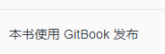

# 隐藏元素

Gitbook 插件：可以隐藏不想看到的元素，比如导航栏中`Published by GitBook`。

`hide-element`是通过HTML元素的class名字来查找要隐藏的元素，想要隐藏元素找到元素的样式类名加到插件配置里面就可以隐藏元素了。

> [!TIP|style:flat|iconVisibility:hidden|labelVisibility:hidden]
> npm install gitbook-plugin-hide-element


在`book.json`的plugins参数中添加插件名和配置信息：

```json
{
    "plugins": [
        "hide-element"
    ],
    "pluginsConfig": {
        "hide-element": {
            "elements": [".gitbook-link"]
        }
    }
}
```

上面的配置信息中设置了隐藏的类名，所以`Published by GitBook` 、`本书使用 GitBook 发布` 就看不见了。



为了尊重原版版权，该插件未开启。

###### Gitbook版权声明

Gitbook 默认在左侧菜单的最下方生成了一句话，`Published by GitBook`，[不同的语言，菜单左下角的版权信息不一样。]

Gitbook 没有提供去掉该信息的配置。