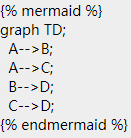
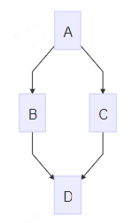
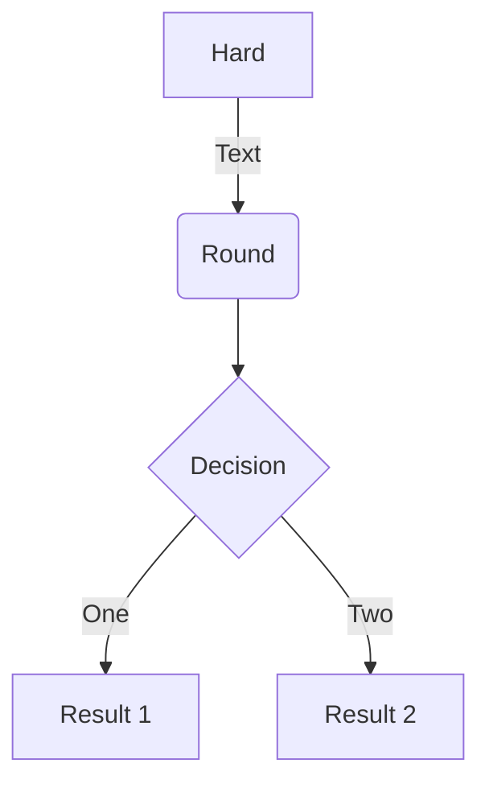
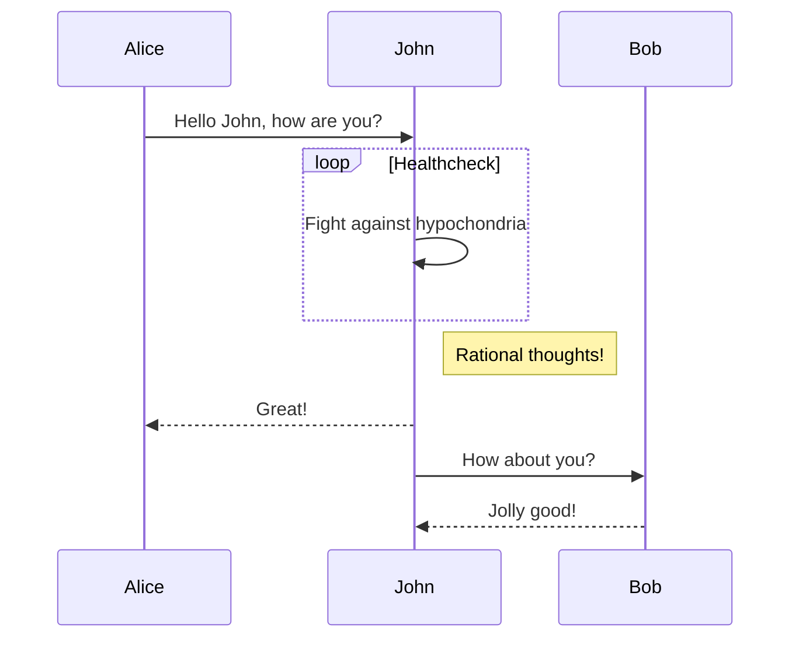
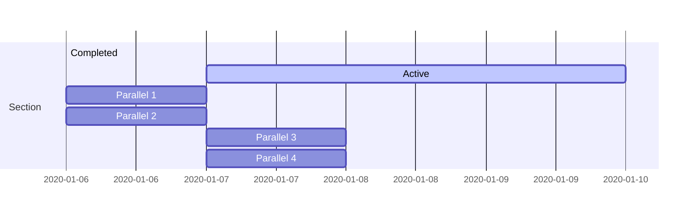
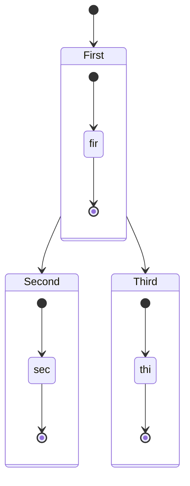

# Mermaid

Gitbook 插件：支持渲染Mermaid图表

## Mermaid

> [!TIP|style:flat|iconVisibility:hidden|labelVisibility:hidden]
> npm install gitbook-plugin-mermaid

[https://github.com/JozoVilcek/gitbook-plugin-mermaid](https://github.com/JozoVilcek/gitbook-plugin-mermaid)

这个插件的依赖比较多，下载时间有点长。

我最终没有下载成功，于是使用了下面的`mermaid-gb3`这个插件。

```json:book.json
{"plugins": [
    "mermaid-gb3"
]}
```

### 使用语法



### 效果展示



## Mermaid-gb3


> [!TIP|style:flat|iconVisibility:hidden|labelVisibility:hidden]
> npm install gitbook-plugin-mermaid-gb3

[https://github.com/chriswessels/gitbook-plugin-mermaid-gb3](https://github.com/chriswessels/gitbook-plugin-mermaid-gb3)

```json:book.json
{
"plugins": [
    "mermaid-gb3"
]
}
```

两个插件语法几乎一致。

### Flow 流程图

```x86asm
graph TD
A[Hard] -->|Text| B(Round)
B --> C{Decision}
C -->|One| D[Result 1]
C -->|Two| E[Result 2]
```



### Sequence 时序图

```powershell
sequenceDiagram
Alice->>John: Hello John, how are you?
loop Healthcheck
    John->>John: Fight against hypochondria
end
Note right of John: Rational thoughts!
John-->>Alice: Great!
John->>Bob: How about you?
Bob-->>John: Jolly good!
```



### Gantt 甘特图

```x86asm
gantt
section Section
Completed :done,    des1, 2020-01-06,2020-01-08
Active        :active,  des2, 2020-01-07, 3d
Parallel 1   :         des3, after des1, 1d
Parallel 2   :         des4, after des1, 1d
Parallel 3   :         des5, after des3, 1d
Parallel 4   :         des6, after des4, 1d
```



### state 状态转移图

```x86asm
stateDiagram
    [*] --> First
    First --> Second
    First --> Third

    state First {
        [*] --> fir
        fir --> [*]
    }
    state Second {
        [*] --> sec
        sec --> [*]
    }
    state Third {
        [*] --> thi
        thi --> [*]
    }
```



> [!WARNING|style:callout|iconVisibility:hidden|label:注意]
> 如果页面内容显示不完整，请F5刷新当前页面