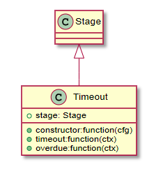

# Puml

Gitbook 插件：使用 `PlantUML` 展示 uml 图。

> [!TIP|style:flat|iconVisibility:hidden|labelVisibility:hidden]
> npm install --save gitbook-plugin-puml

[https://github.com/GitbookIO/plugin-puml](https://github.com/GitbookIO/plugin-puml)

PlantUML 地址：`http://plantuml.com/`

```
{
    "plugins": ["puml"]
}
```
##### 使用示例



```java

Class Stage
    Class Timeout {
        +constructor:function(cfg)
        +timeout:function(ctx)
        +overdue:function(ctx)
        +stage: Stage
    }
    Stage <|-- Timeout

```


效果如下所示：

